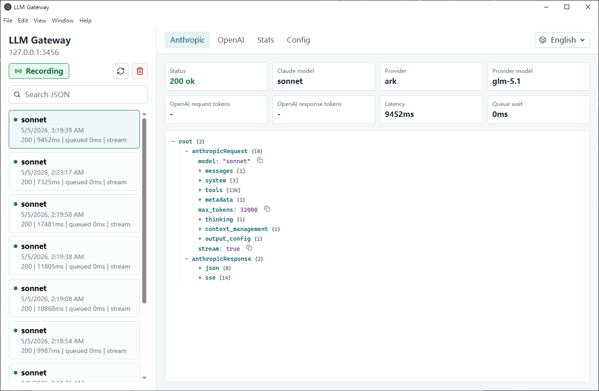

# LLM Gateway

[English](README.md) | [简体中文](README.zh-CN.md)

LLM Gateway is a local Electron app that lets Claude Code call OpenAI-compatible providers through the Anthropic Messages API shape.

It receives Claude/Anthropic requests on `POST /v1/messages`, converts them to OpenAI Chat Completions requests, sends them to the configured provider, then converts the response back to Anthropic format. The app also shows request/response logs so you can inspect routing, payloads, errors, and streaming events.



## What It Is For

- Route Claude Code requests to OpenAI-compatible providers.
- Map different Claude model names to different provider models.
- Use cheaper providers/models for simple Claude Code tasks and stronger providers/models for complex tasks.
- Configure per-provider base URL, API key, optional concurrency limit, and model notes.
- Import/export configuration as JSON.
- Inspect Anthropic request, provider request, provider response, Anthropic response, and SSE stream logs.
- Pause or resume local request logging from the sidebar.
- Review usage statistics by hour, day, or month, grouped by provider, provider model, or Claude model.
- Switch the interface between English, Chinese, or automatic language detection.

## Install

Requires Node.js and npm.

```powershell
npm install
```

## Run

```powershell
npm run dev
```

The app starts a local gateway with the default address:

```text
http://127.0.0.1:3456
```

The default local token is:

```text
local-dev-token
```

Change the host, port, and local token in the Config tab.

## Connect Claude Code

Claude Code supports `ANTHROPIC_BASE_URL` for routing requests through a gateway and `ANTHROPIC_API_KEY` for the `X-Api-Key` header.

PowerShell:

```powershell
$env:ANTHROPIC_BASE_URL="http://127.0.0.1:3456"
$env:ANTHROPIC_API_KEY="local-dev-token"
claude
```

macOS/Linux:

```bash
export ANTHROPIC_BASE_URL="http://127.0.0.1:3456"
export ANTHROPIC_API_KEY="local-dev-token"
claude
```

The value of `ANTHROPIC_API_KEY` must match the gateway `localToken`.

Official Claude Code environment variable reference: https://code.claude.com/docs/en/env-vars

## Configure Providers

Open the Config tab. Providers are configured as JSON.

Example:

```json
{
  "openai": {
    "baseUrl": "https://api.openai.com",
    "apiKey": "sk-...",
    "model_list": ["gpt-4o", "gpt-4o-mini"]
  },
  "ark": {
    "baseUrl": "https://ark.cn-beijing.volces.com/api/coding/v3",
    "apiKey": "your-ark-key",
    "concurrency": 2,
    "model_list": ["doubao-seed-1-6", "kimi-k2-250905"]
  },
  "cheap": {
    "baseUrl": "https://api.example.com",
    "apiKey": "your-provider-key",
    "concurrency": 0,
    "model_list": ["fast-model", "budget-model"]
  }
}
```

Provider fields:

- `baseUrl`: OpenAI-compatible API base URL.
- `apiKey`: API key sent to that provider as `Authorization: Bearer ...`.
- `concurrency`: optional. If missing or `0`, requests are unlimited for this provider. If greater than `0`, that provider gets its own concurrency limit.
- `model_list`: optional notes for models supported by this provider. This is saved, imported, and exported, but does not affect routing.

Base URL handling:

- `https://api.example.com` becomes `https://api.example.com/v1/chat/completions`
- `https://api.example.com/v1` becomes `https://api.example.com/v1/chat/completions`
- `https://ark.cn-beijing.volces.com/api/coding/v3` becomes `https://ark.cn-beijing.volces.com/api/coding/v3/chat/completions`
- A URL already ending in `/chat/completions` is used directly.

## Configure Model Mappings

Model mappings decide which provider/model handles each Claude model name.

Example:

```json
{
  "claude-sonnet-4-5": {
    "provider": "openai",
    "model": "gpt-4o"
  },
  "claude-3-5-haiku-latest": {
    "provider": "cheap",
    "model": "budget-model"
  }
}
```

If a request model is not listed in `modelMappings`, the gateway uses:

- `defaultProvider`
- `defaultModel`

and records a warning in the log.

## Import And Export Config

In the Config tab:

- `Export JSON` downloads the current form state as a JSON file.
- `Import JSON` loads a JSON file into the form.
- Imported config is not applied until you click `Save and restart gateway`.

Save errors are shown beside the buttons. For example, if `defaultProvider` is `openai` but there is no `openai` entry in `providers`, the UI shows:

```text
Default provider "openai" is not configured
```

## Logs

The left sidebar shows recent gateway requests.

For each request, the app records:

- Claude model
- provider id
- provider model
- status code and latency
- queue wait time
- Anthropic request/response
- OpenAI-compatible provider request/response
- streaming events when `stream: true`

Sensitive fields such as authorization headers and API keys are redacted when `Redact sensitive fields` is enabled.

## Usage Stats

The Stats tab summarizes completed requests.

You can choose:

- Granularity: hour, day, or month.
- Grouping: provider, provider model, or Claude model.

The table includes request counts, success/error counts, streaming counts, input/output token totals, total tokens, average latency, and average queue wait time. Streaming OpenAI-compatible requests include `stream_options.include_usage` so providers that support usage chunks can report token usage.

## Development Commands

```powershell
npm run typecheck
npm test
npm run build
```

Run the app:

```powershell
npm run dev
```

## Package For Windows

This project can be packaged with Electron tooling. See [PACKAGING.md](PACKAGING.md) for Windows `.exe` packaging notes.

## Notes

- This gateway currently supports Anthropic `POST /v1/messages`.
- Provider APIs must be compatible with OpenAI Chat Completions.
- Tool calls and streaming responses are converted between Anthropic and OpenAI-compatible formats.
- Provider-specific headers beyond bearer API key are not currently configurable.
